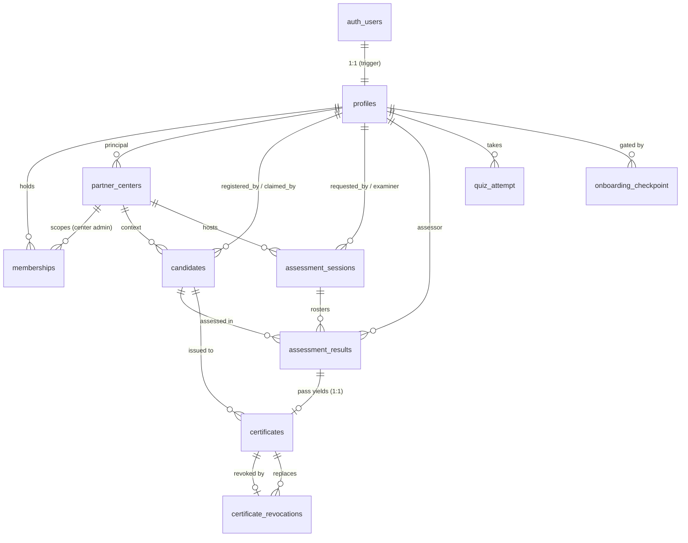

# MAS Swim Badges — Database Schema Reference

Companion to `supabase/migrations/`. Documents the data model and the security
architecture as built through Phase 1 and the issuance core of Phase 2.

Apply workflow is unchanged: paste each migration (in filename order) into the
Supabase SQL editor for project `masbadges-web`. See `migrations/README.md`.

---

## 1. What the database covers

The certificate lifecycle, end to end:

```
register candidate → book session → assign examiner → assess → PASS
   → issue certificate (gated + serialised) → verify (public)
   → revoke → reissue
```

Plus the registry it all hangs off: people, their roles, and partner centers.

---

## 2. Tables at a glance

**People & access**
- `profiles` — one row per authenticated adult, 1:1 with `auth.users`. Minors are never here.
- `memberships` — the RBAC core. One row = one role grant to one person, scoped by state and/or center.

**Registry**
- `partner_centers` — recognition register for swim schools / clubs / academies. Optional for participation.

**Children**
- `candidates` — claimable minor records (5–12). Minimized identity + consent/retention/erasure fields.

**Assessment**
- `assessment_sessions` — a booking/event with an assigned examiner.
- `assessment_results` — one row per candidate per session; the roster until graded, then `pass`/`refer`.

**Certificates**
- `certificates` — append-only ledger. Names snapshotted at issue.
- `certificate_revocations` — append-only; one revocation per cert; links to its reissued replacement.

**Onboarding quiz**
- `quiz_question` — the theory bank. One row per question, scoped by `role_kind`; `options text[]` (4), `correct_index int` (0–3), `active bool`. Correct answers never leave the DB except after submission.
- `quiz_config` — per-role parameters (`draw_size`, `pass_mark`). Mirrors Manual Appendix F; seeded 10 / 8. The standard changes here, never in code.
- `quiz_attempt` — one row per attempt: the drawn `question_ids uuid[]`, the submitted `answers int[]`, `score`, `passed`, timestamps.
- `onboarding_checkpoint` — per profile per role: `quiz_passed`, `coc_accepted_at`, `activated`. The gate `needs_onboarding()` reads this.

---

## 3. Relationships



---

## 4. Security model (the cross-cutting design)

**RLS everywhere, deny-by-default.** Every table has RLS enabled. Access is
granted only by explicit policy; absent a matching policy, the row is invisible.

**`has_role()` is the spine.** Every role check in every policy calls
`has_role(role, center_id?)`. It is `SECURITY DEFINER` so it reads `memberships`
past that table's own RLS — which is what lets policies *on* `memberships` call
it without infinite recursion. It also treats an expired term as inactive even
if the status wasn't flipped.

**Definer helpers follow the same pattern.** `can_assess_candidate()` scopes an
examiner's reads to candidates they're actually assigned to assess — again
definer, to avoid RLS recursion through the assessment tables.

**Two public surfaces, two different shapes, on purpose:**
- `partner_center_directory` — a **view**. Public listing is the point, so an
  anonymous-readable definer view exposing only recognized centers and only safe
  columns is correct. (Shows as a "security definer view" in the linter — intended.)
- `verify_certificate(serial)` — a **function**, not a view. A view would let
  anyone scrape every child's name; a function keyed on an exact serial can only
  confirm a serial you already hold. No enumeration.

**Minors' data is protected in layers:**
- *Minimization* — `candidates` holds identity + governance fields only. No
  address, ID numbers, photos, medical or school data. School/booking detail
  lives on assessment records, not the child's identity.
- *Consent* — explicit flag plus who/when recorded (auditable).
- *Erasure* — `anonymize_candidate()` strips PII but keeps the row so
  certificate lineage survives; `verify_certificate()` masks anonymized names.
- *Scoped reads* — only the registrant, claiming parent, that center's admin,
  the assigned examiner, and program leadership can see a candidate.

**Parent-facing reads are redacted.** `list_session_tracker()` returns session
data to a parent whose child is enrolled, but nulls examiner/booker phone and
email and both instructor/examiner remarks for parent-only scope — contact is
revealed only to governance and to the owner of that contact. Emails and contact
details are never exposed by default; they surface only at designated
communication stages.

**Conflict of interest is enforced in data.** `enforce_assessment_coi()` rejects
any result whose assessor instructs the candidate, and any assessor who isn't an
active examiner. It is a trigger — not a UI rule — so a direct API call can't
bypass it. (Manual §10.1.)

**Certificates are append-only.** `certificates_block_mutation()` blocks every
UPDATE/DELETE outright, beyond RLS. Corrections go through revoke-and-reissue:
revoke (which frees the underlying pass) then issue a corrected cert. A
certificate can't be created at all without a passing result behind it
(`link_certificate_to_result()`), guaranteeing one valid cert per pass.

**Quiz answers stay server-side.** `quiz_question` and `quiz_config` are never
read directly by clients — the quiz RPCs are the only path, and they never
expose `correct_index` before submission. A user reads only their own
`quiz_attempt` and `onboarding_checkpoint`; question/config management is
restricted to `chief_examiner` / `system_admin` / `chairperson`.

---

## 5. Enums

| Enum | Values |
|---|---|
| `my_state` | 13 states + KL, Labuan, Putrajaya |
| `partner_center_status` | pending, recognized, suspended, removed |
| `membership_role` | board_member, coaching_panel, chairperson, chief_examiner, examiner_trainer, examiner, instructor, partner_center_admin |
| `membership_status` | pending, active, suspended, expired, revoked |
| `candidate_status` | active, withdrawn, anonymized |
| `badge_level` | starfish, sea_turtle, guppy, octopus, frog, swordfish, dolphin (1→7) |
| `session_status` | requested, scheduled, completed, cancelled |
| `assessment_outcome` | pass, refer |
| `role_kind` | instructor, examiner |

---

## 6. Onboarding quiz module

First-login theory gate for instructors and examiners. One instrument serves
both the certification course and Portal onboarding (SO-01 / SO-02). Added in
migrations `20260707140000`–`20260707143000`.

**Flow**

```
login → needs_onboarding()? → start_quiz_attempt(role) [draw N, answers hidden]
   → user answers → submit_quiz_attempt(attempt, answers[]) [score, gate, reveal key]
   → pass ≥ pass_mark → onboarding_checkpoint.quiz_passed = true → gate clears
```

**Functions** (all `SECURITY DEFINER`, `search_path=''`)
- `my_role_kinds()` → the caller's role_kind(s), derived from `memberships` in
  status `pending`/`active`. Called in `FROM` as a set-returning function
  (`from public.my_role_kinds() r`).
- `start_quiz_attempt(p_role role_kind)` → draws `quiz_config.draw_size` random
  `active` questions for the role, records the attempt, returns them **without**
  `correct_index`. Raises `42501` if the caller doesn't hold the role.
- `submit_quiz_attempt(p_attempt uuid, p_answers int[])` → scores against
  `correct_index`, persists, flips `onboarding_checkpoint` on a pass, and returns
  the per-question key (answers shown after submission).
- `get_onboarding_status()` → per role: `quiz_passed`, `coc_accepted`,
  `activated`, and an `outstanding text[]`.
- `needs_onboarding()` → boolean for the login redirect (used by `AppLayout`).

**Config note.** `draw_size` and `pass_mark` are the only place the 10-of-25 @
8/10 standard lives operationally; they are recorded in Manual Appendix F. No
client hard-codes them. Question banks are the controlled documents QB-INS /
QB-EXM (Manual Appendix E), loaded by the seed migration.

---

## 7. Open decisions blocking Phases 3–4

These are governance calls, not engineering ones. Each blocks clean schema work
downstream, so resolving them prevents rework.

1. **Child-data retention duration.** `candidates.retention_until` exists but is
   intentionally unset — the *how long* is a board decision. Until set, no
   automated retention/erasure job can be written.
2. **Erasure vs. immutable certificates.** Today anonymization masks the child's
   name in public verification but the append-only certificate retains the
   snapshot internally. If full erasure must scrub the certificate too, that's a
   privileged override of immutability — a policy call to make explicitly.
3. **Parent claiming (blocks Phase 3).** How does a parent prove guardianship to
   claim a candidate? The mechanism (one-time claim code? token? manual
   verification?) determines what columns/flows the claim feature needs.
4. **Fees & payments (blocks Phase 4).** How are partner application and
   assessment fees collected and recorded? Payment provider choice drives the
   fee/transaction tables and whether any of it touches Edge Functions.
5. **Data controller / ownership.** Who is the legal data controller (MAS as an
   entity)? Affects retention, erasure, and the consent wording.
6. **Final web address & brand placement**, and **Phase 1 sign-off.**

---

## 8. Status

| Phase | Scope | State |
|---|---|---|
| 1 | Registry · directory · RBAC · candidates · verification | **schema complete** |
| 2 | Assessment · grading (COI) · issuance | **core complete**; serial gen + pass-gate done |
| 3 | Parent portal (candidate claiming) | blocked on decision #3 |
| 4 | Partner self-service · fees | blocked on decision #4 |
| — | Onboarding quiz module | **complete**; verified end-to-end |
